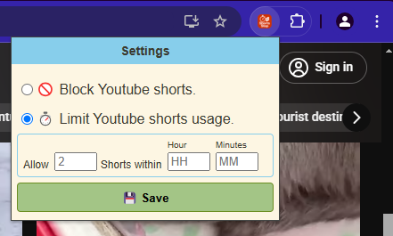

<p align="center" width="100%">
     
</p>

<p width="100%" style="text-align:center">
    ShortStop is a browser[chrome/edge] extension that helps users prevent <b>Doom-Scrolling</b> YouTube Shorts or blocks them entirely.
</p>

The main objective of this extension is to prevent users from Doom Scrolling. Users are given a choice either to block or limit their usage.
Limiting the usage to view Shorts allows users to view relevant shorts without getting distracted in scrolling down an endless loop wasting their time.

## Installation
Download the [zip](https://github.com/MitchJo/shorts-stop/archive/refs/heads/main.zip) or clone this repository. 
```
git clone https://github.com/MitchJo/shorts-stop.git .
```
An follow the steps below for the browser you intend to use this extension.

####  Chrome
- Open Chrome browser.
- On the URL type/paste: `chrome://extensions/`.
- Enable `developer` mode.
- Click on the `Load Unpacked` button.
- Browse to the `cloned repository` or the folder of the unpacked `zip` file.

####  Microsoft Edge
- Open Microsoft Edge browser.
- On the URL type/paste: `edge://extensions/`.
- Enable `developer` mode.
- Click on the `Load Unpacked` button.
- Browse to the `cloned repository` or the folder of the unpacked `zip` file.


### Features
Currently the extension has two features:
- Block Youtube Shorts
<p align="left" width="100%">
     
</p>

- Limit your Youtube shorts usage.
    - This feature allows a user to set the amount of shorts that can be viewed within a set period.
    - If the amount of viewed shorts exceed the configured amount, the Youtube shorts will be blocked until the configured period is reached.
    - After the configured period is reached the watched counter will reset to zero.
    - Example: 
        - Configuration: Allowed = 10; Time = 01Hr00Mins
        - You can watched 10 shorts in a period of 1Hr00Mins. After the 1Hr00Mins the amount resets.
        - The time is calculated from the moment a user clicked on the first short.
<p align="left" width="100%">
     
</p>